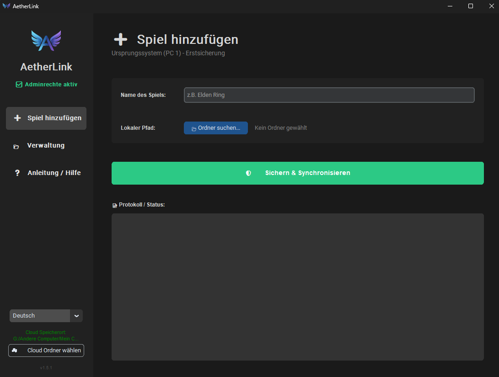
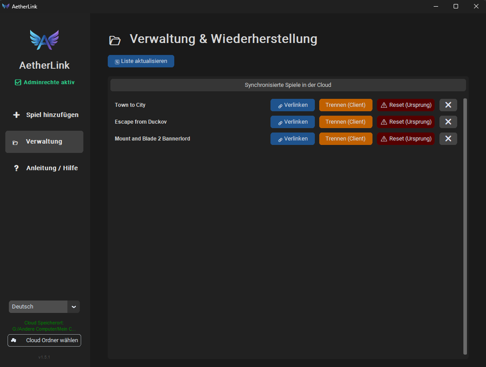

<div align="center">

  

  # AetherLink
  
  **Seamless Game Save Synchronization for Windows**
  
  [](https://www.python.org/)
  [](https://www.microsoft.com/windows)
  [](https://github.com/)

  <p>
    <b>🇬🇧 English</b> •
    <a href="README-DE.md">🇩🇪 German</a>
  </p>

  <p>
    <a href="#-features">Features</a> •
    <a href="#-how-it-works">How It Works</a> •
    <a href="#-installation">Installation</a> •
    <a href="#-usage-guide">Usage</a>
  </p>

</div>

---

## 🚀 About The Project

**AetherLink** is a modern, user-friendly tool designed to synchronize your local PC game saves with any cloud provider (Google Drive, Dropbox, OneDrive) using **symbolic links**. 

Unlike other tools, AetherLink distinguishes between the **Origin PC** (where the save comes from) and **Client PCs** (where you want to play), ensuring your data is safe. It includes automatic local backups before any critical operation to prevent data loss.

> **✨ Created via Vibe Coding:** This entire project—from concept to the final line of code—was generated through an iterative "Vibe Coding" process, focusing on rapid prototyping, modern UI design, and user-centric functionality.

---

## 📸 Screenshots

| **Dashboard & Setup** | **Management & Restore** |
|:---:|:---:|
|  |  |
| *Modern Dark-UI for easy setup* | *Manage links and restore backups* |

---

## ✨ Features

*   **☁️ Universal Cloud Sync:** Works with any folder that synchronizes with the cloud.
*   **🛡️ Safety First:** automatically creates local `.zip` backups before moving or linking files.
*   **🖥️ Multi-PC Logic:**
    *   **PC 1 (Origin):** Moves saves to cloud and links them.
    *   **PC 2+ (Client):** Detects existing saves, backs them up, and links to the cloud.
*   **↩️ Smart Restore:** Easily unlink and restore original files if you want to stop syncing.
*   **🎨 Modern UI:** Built with `CustomTkinter` for a sleek, dark-themed Windows 11 look.
*   **🌍 Multi-Language:** Full support for **English** and **German**.
*   **🔧 Admin Handling:** Automatically requests necessary permissions to create symbolic links.

---

## ⚙️ How It Works

AetherLink uses the **"Sync & Link"** method:

1.  **Move:** The program moves your local save folder (e.g., from `AppData`) to your Cloud folder.
2.  **Link:** It places a *Symbolic Link* (Symlink) in the original location.
3.  **Sync:** The game thinks the files are still there, but they are physically in the cloud, syncing to all your devices.

---

## 📥 Installation

### Option A: Run from Source (Python)

1.  **Clone the repo**
    ```bash
    git clone https://github.com/YOUR_USERNAME/AetherLink.git
    cd AetherLink
    ```
2.  **Install dependencies**
    ```bash
    pip install customtkinter pillow pyinstaller
    ```
3.  **Run the application**
    ```bash
    python aetherlink.pyw
    ```

### Option B: Build Executable (.exe)

If you want a portable file to share between PCs:

1.  Run the included build script (if available) or use:
    ```bash
    py -m PyInstaller --noconsole --onefile --uac-admin --clean --icon=app_icon.ico --add-data "app_icon.ico;." --name=AetherLink aetherlink.pyw
    ```
2.  Find `AetherLink.exe` in the `dist` folder.

---

## 🎮 Usage Guide

### 🖥️ On PC 1 (The Origin)
*Where your save files currently are.*

1.  Select your **Cloud Folder** (bottom left).
2.  Go to **"Add Game"**.
3.  Enter the Game Name and browse for the local save folder.
4.  Click **"Backup & Sync"**.

### 💻 On PC 2, 3... (The Clients)
*Where you want to continue playing.*

1.  Select the **same Cloud Folder**.
2.  Go to **"Manage"**.
3.  Find the game in the list and click the blue **"🔗 Link Here"** button.
    *   *Note: If a local save exists on PC 2, AetherLink will back it up automatically before linking.*

### 🔓 Unlinking / Uninstalling
*   **Client:** Click "Unlink (Client)" to remove the link and restore local backups. Cloud data remains safe.
*   **Origin:** Click "Reset (Origin)" to pull data back from the cloud and delete the cloud copy.

---

## 🤝 Contributing

This project was built using Vibe Coding, but contributions are welcome!

1.  Fork the Project
2.  Create your Feature Branch (`git checkout -b feature/AmazingFeature`)
3.  Commit your Changes (`git commit -m 'Add some AmazingFeature'`)
4.  Push to the Branch (`git push origin feature/AmazingFeature`)
5.  Open a Pull Request

---

## 📄 License

Distributed under the MIT License. See `LICENSE` for more information.

---

<div align="center">
  <sub>Built with 💜 and AI.</sub>
</div>
